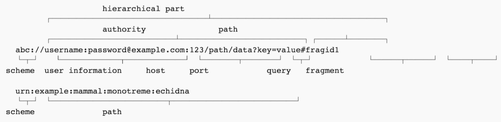
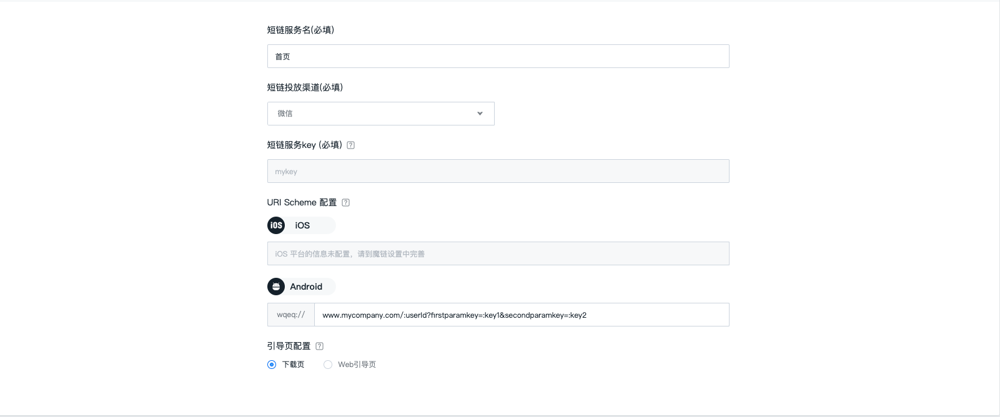

# URI Scheme 的最佳实践

## 资源

在 Web 时代，我们推崇使用 Restful 的架构，因为 Restful 能够更好地使用现有 Web 标准中的一些准则和约束。虽然 Rest 本身受 Web 技术的影响很深， 但是理论上 Rest 架构风格并不是绑定在 HTTP 之上，而且 Rest 跟资源与 URI 关系又非常密切。
那什么是资源呢？任何事物，只要有被引用到的必要，它就是一个资源。资源可以是实体(例如手机号码)，也可以只是一个抽象概念(例如价值) 。下面是一些资源的例子:

- 某用户的手机号码
- 某用户的个人信息
- 最多用户订购的 GPRS 套餐
- 两个产品之间的依赖关系
- 某用户可以办理的优惠套餐
- 某手机号码的潜在价值

## 唯一标识

要让一个资源可以被识别，需要有个唯一标识，在 Web 中这个唯一标识就是 URI（Uniform Resource Identifier）。URI 既可以看成是资源的地址，也可以看成是资源的名称。

同样，在 App 里我们使用 URI Scheme 来像定位一个网页一样，定位一个应用甚至应用里的某个具体的功能。URI Scheme 的通用格式是:
scheme:[//[user:password@]host[:port]][/]path[?query][#fragment]

一般情况下，我们推荐这样使用 URI Scheme:
scheme://host/path?query

下面这张图展示的例子，显示了 uri 和它的各个组件。



## Scheme

那么 URI Scheme 是如何工作的呢？以大众点评的官方网站和大众点评 App 做个简单对比来进行说明。前者是网页的 url，后者是 App 的 URI Scheme。

|                   |                 网页                  |              app               |
| :---------------: | :-----------------------------------: | :----------------------------: |
| 网站首页/打开应用 |       http://www.dianping.com/        |          dianping://           |
|  子页面/具体功能  | http://www.dianping.com/shop/1859284/ | dianping://shopinfo?id=1859284 |

在这里，http://www.dianping.com 和 dianping:// 都声明了这是谁的地盘。然后在http://www.dianping.com 后面加上 /shop/1859284/ 就跳转到从属于 http://www.dianping.com 的一个网页上；同样，在 dianping:// 后面加上 shopinfo?id=1859284 就进入了大众点评 App 的一个具体的页面——上海来福士广场。

因此，每一个 App 如果都规划好自己的 URI Scheme，那么可以方便其他 App 快速唤醒它的某一个功能。

以格瓦拉为例，它的 URI Scheme 就规划得非常好，细粒度的控制。

- 电影列表服务：能够进入格瓦拉 App 的电影列表页面
- 电影详情服务：能够进入格瓦拉 App 某一部电影的详情页面。这个服务的 URI Scheme 类似于 gewara://com.gewara.movie?movieid=123456
- 电影院详情服务：能够进入格瓦拉 App 某一家电影院的页面。这个服务的 URI Scheme 类似于 gewara://com.gewara.movie?cinemaid=123456
- 影院场次服务：能够基于日期查看格瓦拉 App 中某一家影院电影的排期情况。这个服务的 URI Scheme 类似于 gewara://com.gewara.movie?cinemaid=123456&date=2016-05-20
- 影片视频服务：能够进入格瓦拉 App 查看某一部影片的片花。这个服务的 URI Scheme 类似于 gewara://com.gewara.movie?videoNo=789000&movieid=123456

这些 URI Scheme 是格瓦拉比较有代表性的，有了这些 Schemes 可以方便其他的 App 快速唤醒格瓦拉 App，同时也方便借助 H5 页面唤醒原生的格瓦拉 App。既方便了引流，也便利了 App 的自增长。

## 极光魔链中的应用

极光魔链 sdk 是做 deep link 的，它支持 URI Scheme 动态传值，在 [scheme://][host:port][path][?query][#fragment] 格式中，只限于在 path 和 query 中传值。


例如一个带有动态参数完整的 URL Scheme 配置 wqeq://www.mycompany.com/:userId?firstparamkey=:key1&secondparamkey=:key2，建议在极光魔链后台配置完整结构（包含scheme/host:prot/path/query）的 URL Scheme 信息

+  「冒号:」：在scheme头和命令之间；
+  「双斜杠 //」：在链接头和命令之间，如果host省略，会是三斜杠 ///；
+  「问号 ?」：在命令和参数之间；
+  「等号 =」：在参数和值之间；
+  「与符号 &」：在一组参数和另一组参数之间。


|          部分         |                 参数                  |              意义               |
| :---------------: | :-----------------------------------: | :----------------------------: |
| scheme |       wqeq://       |          某应用的领域           |
|  host:port  | www.mycompany.com | 某一个域名 |
|  path  | /:userId | 路径占位符，可以有多个，每个用/连接</br> 如path1/path2/path3 |
|  query  | ?firstparamkey=:key1&secondparamkey=:key2| 参数：firstparamkey，secondparamkey</br>值：key1，key2，其中key1和key2 是占位符 |

```
tips
URL Scheme 配置需和客户端协定，占位符通过 JS SDK 方法传递参数，完成赋值。如不使用占位符（动态参数），亦可在极光魔链的短链管理中给 URI 的参数赋值 wqeq://www.mycompany.com/shopping?firstparamkey=123456&secondparamkey=654321
```

### **path** 中可以动态传值的例子

+ myapp://myhost.com/:userId <br>
+ userId 表示是动态参数，它表示的服务可以是用户中心的服务
   
### **query** 中可以动态传值的例子

+ myapp://myhost.com?order=:orderId <br>
+ orderId 表示是动态参数，它表示的服务可以是查询某个订单的服务  

+ myapp://myhost.com?cityId=:cityId&hotelBrand=:hotelBrand 
+ 其中 cityId、hotelBrand 表示是动态参数，它表示的服务可以是某个城市某个酒店品牌的列表服务

### **path、query** 中都可以动态传值的例子

+ myapp://myhost.com/:userId?order=:orderId <br>
+ userId 和 orderId 表示是动态参数，它表示的服务可以是查询某个用户的某个订单的服务
