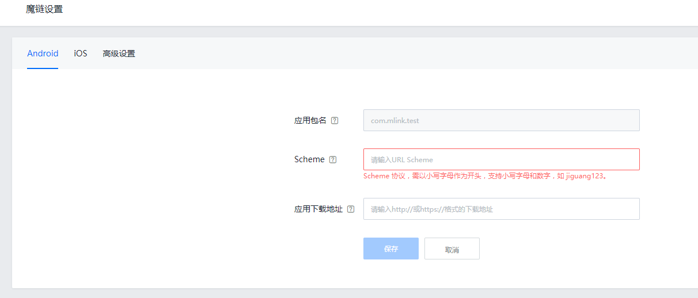
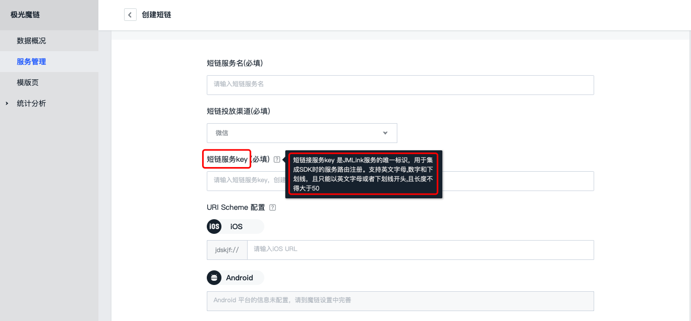

#Android SDK API

##名词约定
|名称|解释|备注|极光魔链后台位置|
|----|----|----|----|
|URI Scheme|App之间相互调用的入口，且可传递参数。需要在 AndroidManifest.xml 内启动页activity内填写。|例如：mwsdk://,代码内只要填写 mwsdk 即可，注意：首字母不能为数字，不支持大写字母，不支持下划线等特殊字符。|左部导航->“应用设置”->“魔链设置”->“Scheme”|
|JMLink Key|JMLink 的唯一标识。移动端用此来获取 JMLink 具体的 URI Scheme。后台配置 JMLink 时填写|注意与代码内register()第一个参数保持一致。|左部导航->“极光魔链”->”服务管理“->“创建短链”->“短链服务Key”|





##Scheme集成
Android系统中App之间是相互隔离的，通过URI Scheme，App之间可以相互调用，并且可以传递参数。

manifest中配置：

```
<!-- 将“你的Scheme”替换为后台填写的URI Scheme。-->
<activity
    android:name=".WelcomeActivity">
    <intent-filter>
        <data android:scheme="你的Scheme"/>
        <action android:name="android.intent.action.VIEW" />
        <category android:name="android.intent.category.DEFAULT" />
        <category android:name="android.intent.category.BROWSABLE" />
    </intent-filter>
    <intent-filter>
        <action android:name="android.intent.action.MAIN" />
        <category android:name="android.intent.category.LAUNCHER" />
    </intent-filter>
</activity>

```

##SDK初始化

###支持的版本
1.0.0

###接口定义

+ ***JMLinkAPI.getInstance().init(Context context)***
	+ 接口说明：
		+ 初始化接口。建议在Application的onCreate中调用
	+ 参数说明：
		+ context：android的上下文
	+ 调用示例：

~~~
	JMLinkAPI.getInstance().init(this);
~~~

##SDK设置debug模式

###支持的版本
1.0.0

###接口定义

+ ***JMLinkAPI.getInstance().setDebugMode(boolean enable)***
	+ 接口说明：
		+ 设置是否开启debug模式。true则会打印更多的日志信息。建议在init接口之前调用。
	+ 参数说明：
		+ enable：debug开关
	+ 调用示例：

~~~
	JMLinkAPI.getInstance().setDebugMode(true);
~~~

##JMLink key与页面绑定
为了实现从jmlink服务跳转到app指定页面，app端需要通过sdk将jmlink key（portal中创建短链服务时指定），和具体的页面做绑定。具体有两种方法：

### 一、通过注解绑定

#### 支持的版本
1.0.0

#### 接口定义

+ ***JMLinkAPI.getInstance().registerWithAnnotation()***
	+ 接口说明：
		+ 开启注解绑定功能。调用之后sdk会将所有标注了`JMLinkRouter`注解的类与jmlink key做绑定。  建议在Application类sdk init之后调用。
	+ 调用示例：

~~~
//开启注解绑定
public class JMLinkExampleApplication extends Application {
    @Override
    public void onCreate() {
        super.onCreate();
		JMLinkAPI.getInstance().setDebugMode(true);
        JMLinkAPI.getInstance().init(getApplicationContext());
        JMLinkAPI.getInstance().registerWithAnnotation();//开启注解绑定
    }
}

//注册默认路由，当下发的jmlink key没有与任何页面绑定时，跳转到此页面
@JMLinkDefaultRouter
public class DefaultRouteActivity extends Activity {


    @Override
    protected void onCreate(Bundle savedInstanceState) {
        super.onCreate(savedInstanceState);
        setTitle("DefaultRouteActivity");
    }

}

//注册路由，当下发的jmlink key与此处的“jmlink_key”一致时，跳转到此页面
@JMLinkRouter(keys = "jmlink_key")
public class SecondActivity extends Activity {

    @Override
    protected void onCreate(Bundle savedInstanceState) {
        super.onCreate(savedInstanceState);
        setTitle("SecondActivity");

        //通过intent方式获取动态参数值
        Intent intent = getIntent();
        if (intent != null) {
            String param = intent.getStringExtra("param");
        }
    }
}
~~~

<span style="color: #f2cf4a;">注意：如果有 Fragment 作为页面，您需要跳转到具体Fragment时，您可能需要：  
	① 在 JMLink 的动态参数添加type来区别是哪个 Fragment  
	② 在它的 FragmentActivity 内添加注解，然后根据type判断具体跳转到哪个 Fragment。
</span>


### 二、通过接口动态绑定
除了registerWithAnnotation()，我们还提供register()。方便开发者在跳转前处理一些额外动作，比如登录等。
如跳转前需要登录等，可用下面的register方法
#### 支持的版本
1.0.0

#### 接口定义

+ ***JMLinkAPI.getInstance().registerDefault(JMLinkCallback callback)***
	+ 接口说明：
		+ 注册默认路由回调。当下发的jmlink key没有任何页面匹配时，将触发此处`JMLinkCallback`回调。开发者可以在回调中触发实际页面的跳转。 建议程序启动页面onCreate中调用。***并且一定要在router()接口前调用***
	+ 参数说明：
		+ callback：接口回调
	+ 回调说明：
    ***execute(Map<String, String> paramMap, Uri uri)***
  		+ paramMap: 跳转时带的自定义参数map
    	+ uri:用于跳转的实际uri

+ ***JMLinkAPI.getInstance().register(String jmlinkKey, JMLinkCallback callback)***
	+ 接口说明：
		+ 针对指定jmlink key注册路由回调。当下发的jmlink key与此处指定的jmlinkKey匹配时，将触发此处`JMLinkCallback`回调。开发者可以在回调中触发实际页面的跳转。 建议程序启动页面onCreate中调用。***并且一定要在router()接口前调用***
	+ 参数说明：
		+ jmlinkKey:jmlink 的 key，jmlink的唯一标识
		+ callback：接口回调
	+ 回调说明：
    ***execute(Map<String, String> paramMap, Uri uri)***
  		+ paramMap: 跳转时带的自定义参数map
    	+ uri:用于跳转的实际uri 	

+ ***JMLinkAPI.getInstance().unregisterDefault()***
    + 接口说明：
	    + 反注册默认路由，执行该方法会删除已注册的默认路由，由于注册默认路由时JMLinkCallback中可能包含当前界面的引用，如果不进行反注册回收的话，可能发生内存泄露，可在回调执行后执行本方法进行反注册。

+ ***JMLinkAPI.getInstance().unregister(String jmlinkKey)***
    + 接口说明：
	    + 反注册指定jmlinkKey的路由回调，执行该方法会删除已注册的针对指定jmlink key注册的路由回调，由于注册路由时JMLinkCallback中可能包含当前界面的引用，如果不进行反注册回收的话，可能发生内存泄露，可在回调执行后执行本方法进行反注册。

	+ 调用示例：

~~~

@Override
public void onCreate(Bundle savedInstanceState) {
    super.onCreate(savedInstanceState);
    register (this);
}
private void register(Context context){
    JMLinkAPI.getInstance().registerDefault(new JMLinkCallback() {
        @Override
        public void execute(Map<String, String> paramMap, Uri uri) {
		    JMLinkIntentBuilder.buildIntent(paramMap, context, DefaultRouteActivity.class);
			unregister();
        }
   });
	// jmlinkKey:  jmlink 的 key, jmlink的唯一标识
   JMLinkAPI.getInstance().register("您的jmlinkKey", new JMLinkCallback() {
        public void execute(Map<String, String> paramMap, Uri uri) {
		    JMLinkIntentBuilder.buildIntent(paramMap, context, SecondActivity.class);
			unregister();
        }
    });
}

private static void unregister() {
     JMLinkAPI.getInstance().unregisterDefault();
	 JMLinkAPI.getInstance().unregister("您的jmlinkKey")
}


~~~
或者使用静态类实现JMLinkCallback
~~~
@Override
public void onCreate(Bundle savedInstanceState) {
    super.onCreate(savedInstanceState);
    register();
}

private void register(){
	JMLinkAPI.getInstance().registerDefault(new DefaultCallback(getApplicationContext()));
	// jmlinkKey:  jmlink 的 key, jmlink的唯一标识
	JMLinkAPI.getInstance().register("您的jmlinkKey", new KeyCallback(getApplicationContext()));
}

static class DefaultCallback implements JMLinkCallback {
	private Context context;
	public DefaultCallback(Context context) {
		this.context = context;
	}
	@Override
	public void execute(Map<String, String> paramMap, Uri uri) {
		JMLinkIntentBuilder.buildIntent(paramMap, context, DefaultRouteActivity.class);
	}
}

static class KeyCallback implements JMLinkCallback {
	private Context context;
	public KeyCallback(Context context) {
		this.context = context;
	}

	@Override
	public void execute(Map<String, String> paramMap, Uri uri) {
		JMLinkIntentBuilder.buildIntent(paramMap, context, SecondActivity.class);
	}
}
~~~


## 具体页面跳转
通过以下接口，可以实现：

+ 通过短链从手机浏览器打开App具体页面（scheme拉起）
+ 借助应用宝，实现从微信内直接打开App具体页面。(如果下载链接是应用宝，建议支持应用宝下载直跳。)
+ App未安装时，通过短链跳转到下载页面，安装后，第一次打开跳转到之前的页面实现场景还原。

### 一、通过scheme拉起时的页面跳转
通过scheme拉起的应用，在其intent.getData中，会包含拉起时传递过来的uri。拿到这个uri调用router接口即可跳转到指定页面。

#### 支持的版本
1.0.0

#### 接口定义

+ ***JMLinkAPI.getInstance().router(Uri jMLinkUri)***
	+ 接口说明：
		+ 根据应用启动时intent data中带的uri，跳转到具体页面。***需要在manifest中配置的scheme接收的activity中调用。并且必须在jmlink key与页面绑定完成之后调用。***
	+ 参数说明：
		+ jMLinkUri：应用启动时intent data中带的uri
	+ 调用示例：

~~~

public class WelcomeActivity extends Activity {
    @Override
    protected void onCreate(Bundle savedInstanceState) {
        super.onCreate(savedInstanceState);
		JMLinkAPI.getInstance().registerWithAnnotation();
        Uri uri = getIntent().getData();
        if (uri != null) { //uri不为null，表示应用是从scheme拉起
            JMLinkAPI.getInstance().router(uri);
            finish();
        }
    }
}

~~~

### 二、通过应用宝或者其他场景拉起时的页面跳转
被应用宝或者launcher等其他场景拉起的应用，其intent.getData中，没有任何uri相关信息。此时需要调用checkYYB接口检查是否是应用宝拉起，如果是由应用宝拉起，且开发者在极光后台开启了应用宝跳转，sdk会自动跳转到目标页面。

#### 支持的版本
1.0.0

#### 接口定义

+ ***JMLinkAPI.getInstance().checkYYB(YYBCallback callback)***
	+ 接口说明：
		+ 检查是否是从应用宝跳转拉起的应用，如果是，且开发者在后台打开了应用宝跳转开关。则直接跳转到具体页面。***需要在manifest中配置的scheme接收的activity中调用。并且必须在jmlink key与页面绑定完成之后调用。***
	+ 参数说明：
		+ callback：回调接口
	+ 回调说明：  
	***onSuccess()***  
	是从应用宝拉起，并且跳转到具体页面成功时触发。  
	***onFail()***  
	不是从应用宝拉起，或者跳转到具体页面失败时触发。
	
	
	
+ ***JMLinkAPI.getInstance().checkYYB(int timeout, YYBCallback callback)***
	+ 接口说明：
		+ 检查是否是从应用宝跳转拉起的应用，如果是，且开发者在后台打开了应用宝跳转开关。则直接跳转到具体页面。***需要在manifest中配置的scheme接收的activity中调用。并且必须在jmlink key与页面绑定完成之后调用。***
	+ 参数说明：
		+ timeout:检查应用宝拉起请求超时时间
		+ callback:回调接口
	+ 回调说明：  
	***onSuccess()***  
	是从应用宝拉起，并且跳转到具体页面成功时触发。  
	***onFail()***  
	不是从应用宝拉起，或者跳转到具体页面失败时触发。
	+ 调用示例：

~~~

public class WelcomeActivity extends Activity {
    @Override
    protected void onCreate(Bundle savedInstanceState) {
        super.onCreate(savedInstanceState);
        Uri uri = getIntent().getData();
        if (uri != null) {  //uri不为null，表示应用是从scheme拉起
            JMLinkAPI.getInstance().router(uri);
            finish();
        } else {  //uri为null，表示应用是从应用宝或其他方式拉起
            JMLinkAPI.getInstance().checkYYB(new YYBCallback() {
                @Override
                public void onFailed() {
                    gotoDefault();
                }

                @Override
                public void onSuccess() {
                    finish();
                }
            });
        }
    }
}

~~~

### 三、场景还原
App未安装时，通过短链跳转到下载页面。安装后，第一次打开App，能够跳转到之前的浏览的具体页面的能力，被称为“场景还原”。

#### 支持的版本
1.0.0

#### 接口定义

+ ***JMLinkAPI.getInstance().deferredRouter()***
	+ 接口说明：
		+ 检查应用是否需要触发场景还原，如果是，则直接跳转到具体页面。***需要在jmlink key与页面绑定完成之后调用。***
	+ 调用示例：

~~~

public class WelcomeActivity extends Activity {
    @Override
    protected void onCreate(Bundle savedInstanceState) {
        super.onCreate(savedInstanceState);
		JMLinkAPI.getInstance().registerWithAnnotation();
        JMLinkAPI.getInstance().deferredRouter();
    }
}

~~~

## 无码邀请
用户A分享App内容给用户B，用户B通过用户A分享的H5页面安装App，则用户A可以累积相应积分，全程无需邀请码。

### 支持的版本
1.0.0

### 接口定义

+ ***JMLinkAPI.getInstance().getParam(String key)***
	+ 接口说明：
		+ 检查应用是否需要触发场景还原，如果是，则直接跳转到具体页面。***需要在jmlink key与页面绑定完成之后调用。***
	+ 参数说明：
		+ key:开发者传递的自定义参数的key。比如"u_id"
	+ 结果返回：
		+ String:自定义参数实际值。如果不存在则返回null
	+ 调用示例：

~~~
    String uid = JMLinkAPI.getInstance().getParam("u_id");
~~~


