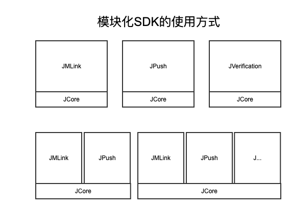

#Android SDK 概述

##JMLink Android

###模块化的极光开发者SDK

极光开发者服务SDK采用了模块化的使用模式，即一个核心（JCore）+N种服务（JPush，JMLink，JVerification，...）的使用方式，方便开发者使用某一项服务或多项服务，极大的优化了多模块同时使用时功能模块重复的问题。如下图：

##压缩包说明

### JMLink 压缩包简介

+ example/
    + 一个用来展示JMlink基本用法的demo应用
+ libs/jcore-android.2.X.Y.jar
    + 极光开发者服务的核心包
+ libs/JMlink-Android-SDK-v1.X.Y.jar
    + JMLink SDK开发包
+ libs/(cpu-type)/libjcore2xy.so
    + 各种CPU类型的native开发包

##集成方式

目前SDK只支持Android 2.3或以上版本的手机系统。参考：[Android SDK 集成指南](./android_guide)

##接口说明

参考：[Android SDK API](./android_api)

##技术支持

当出现问题时：

* 请仔细阅读文档，查看是否有遗漏
* 给我们的support发邮件：[support&#64;jpush.cn](mailto:support&#64;jpush.cn)

为了更快速的解决问题，在寻求帮助时，请提供下列信息：

* 提供appKey
* 如果是SDK问题请提供对应的SDK版本和完整的日志记录
