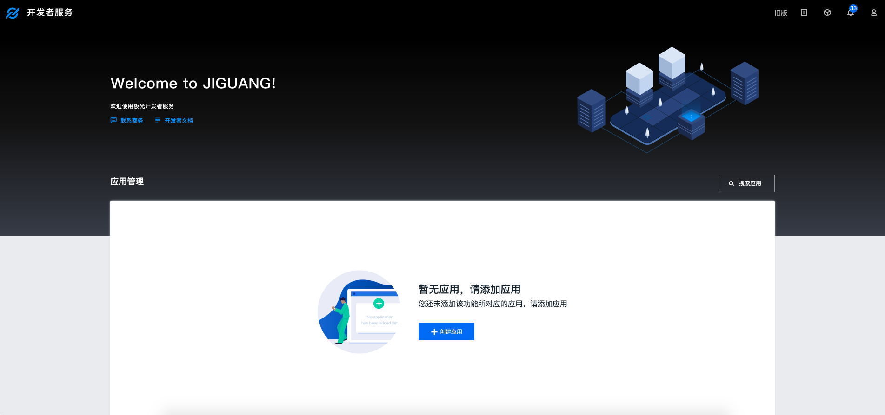
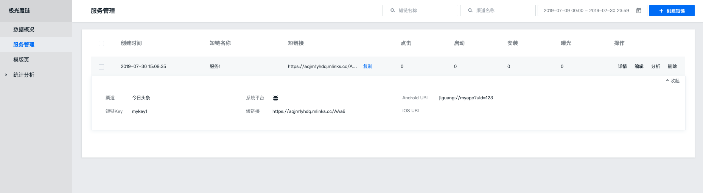

# JMLink Web SDK 集成指南

## 使用提示

本文是 JMLink Web SDK 标准的集成指南文档。

- 极光推送文档网站上，有相关的所有指南、API、教程等全部的文档。包括本文档的更新版本，都会及时地发布到该网站上。

## 产品说明

根据您在 Portal 端配置的应用信息，通过整合唤起应用方式，JMLink 将在不同设备和不同浏览器下尝试最佳唤起应用方式。

## 创建应用

### 创建极光开发者帐号

请访问[极光官方网站](https://www.jiguang.cn/accounts/register) 注册您的极光账号。


### Portal 上创建应用

使用注册账号登陆，进入极光控制台后，点击“创建应用”按钮，进入创建应用的界面。填上你的应用程序的名称就可以了，最后点击最下方的 “创建我的应用”按钮，创建应用完毕。



### 配置应用信息

创建应用之后返回用户主页面可以看到应用清单，点选你刚才创建的应用来查看应用信息。并配置 JMLink 必要参数。



### 短连接

后台配置完 JMLink 必要参数，您将获得类似 https://a.jmlk.co/ABCD 的短连接，其中 ABCD 为短链接后缀码。

## SDK 接入

```
<script src="https://static.jmlk.co/scripts/dist/jmlink.min.js"></script>
```

引入该 JS 后，就可以使用 Window 上的全局对象 JMLink

特别提示：请直接使用此链接, 不要将此文件下载到您项目中, 否则, 我们在更新数据结构或 API 接口后有可能会导致功能失效。

## SDK 初始化

### 在 HTML 页面中准备一个或多个用于打开 APP 的 a 元素

一般开发者会使用 CSS 样式重置这个链接的外观，使其看起来像一个按钮，建议使用“打开 APP”、“在 APP 中购买”、“在 APP 中阅读”等对用户有实际引导意义的文案，请尽量避免使用“下载 APP”，在以往的用户使用习惯中我们发现使用“下载 APP”的链接对比使用“打开 APP”的链接的点击率会低好几倍；

```
<a id="btnOpenApp">打开APP</a>
```

### 单个 a 标签初始化

```
new JMLink({
    jmlink:'https://a.jmlk.co/ABCD',// 短链地址
    button:document.querySelector('a#btnOpenApp')
});

```

### 多个 a 标签初始化

```
var link='https://a.jmlk.cc/ABCD';// 短链地址
var btn_1=document.querySelector('a#btnOpenApp1');
var btn_2=document.querySelector('a#btnOpenApp2');
var btn_3=document.querySelector('a#btnOpenApp3');

var configs = [
    {
        jmlink: link+'?name=1',
        button: btn_1
    }, {
        jmlink:link+'?name=2',
        button: btn_2
    }, {
        jmlink: link+'?name=3',
        button: btn_3
    }
];

new JMLink(configs);
```

### 更多 API

其他 API 的使用方法请参考接口文档：[Web SDK API](../Web/jmlink_web_api.md)

## 技术支持

邮件联系：[support&#64;jiguang.cn](mailto:support@jiguang.cn)
