# iOS JMLink SDK 常见问题

## Universal link 

### 1. JMLink和App都配置了Universal link，但是无法从微信跳转到App？

1.1 确认设备系统是iOS9以上,Universal link仅支持iOS9以上

1.2 是否被用户手动取消

当使用 Universal link打开App之后，右上角会出现简短的域名地址,点击右上角会取消 Universal link

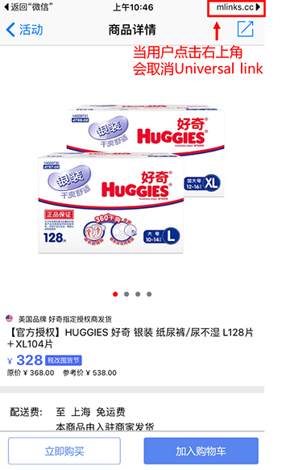

在Safari中打开链接，会出现smart banner，点击“打开”按钮，Universal link将恢复正常

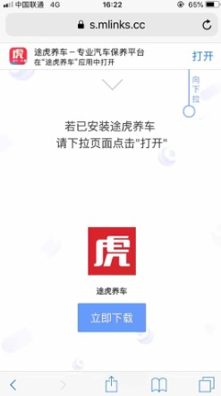

1.3 Team ID 是否填写正确

如下图，Team ID 和 Prefix正常情况下值都是一样的，当两处的值不一样的时候，优先使用Prefix

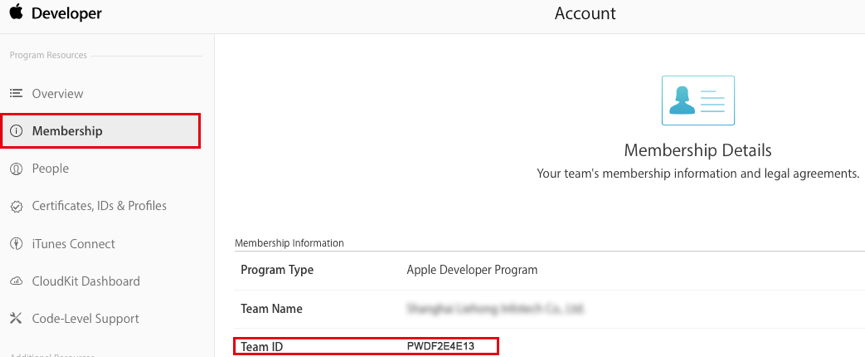
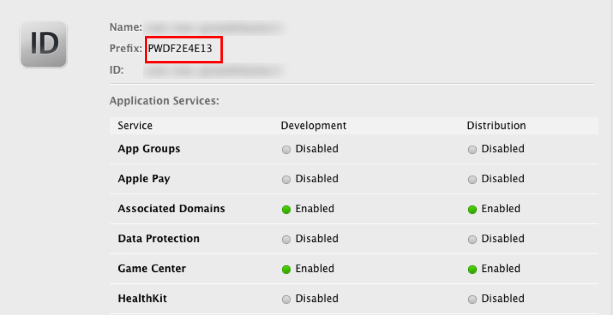

1.4 自动打包和手动打包

使用xcodebuild自动打包会影响Universal link的使用，请使用手动打包

### 2. 在编辑Associated Domains 的时候，报错，错误信息“An App ID with Identifier ‘com.XXX’ is not available”，怎么解决？

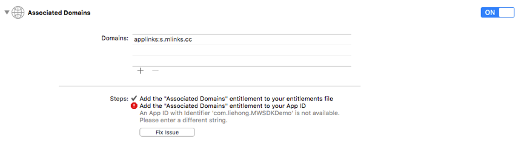

进入苹果开发者帐号，将当前App ID 的Associated Domains 设置成Enable，如下图：

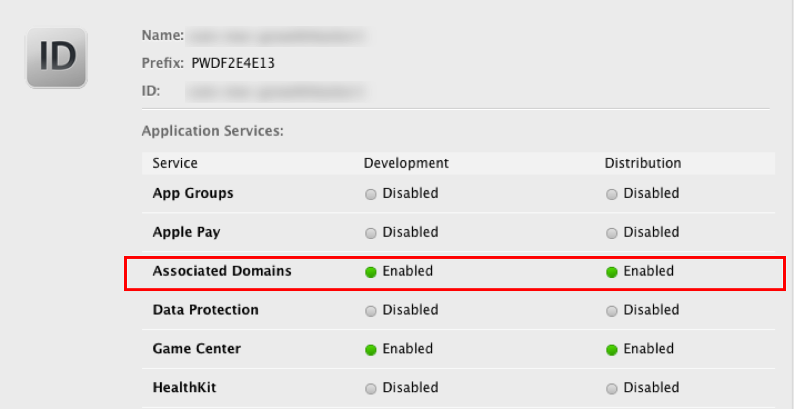

### 3. 右上角的“mlinks.cc”如何去掉或者更改

iOS9+，在微信中唤起app之后，右上角会出现"mlinks.cc"的标记，这个是使用universal link唤起app的标记，和左边的返回标记一样，由系统控制，无法去掉，无法控制。如果要将"mlinks.cc"字改成自己域名的话，需要自己配置实现universal link，然后在后台的app管理中填写上自己的universal link url即可，mlink还是照常使用。

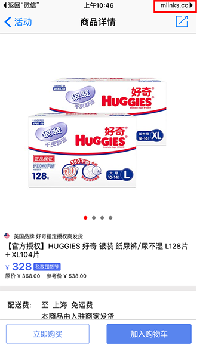

### 4. App重新签名之后，使用短链无法正常唤起app，如何解决？

第一步，确保app在重新签名之前，可以使用短链接正常唤起

第二步，查看重新签名之后的ipa中有没有包含正确的associated domain

如何查看associated domain中的包含的内容是否正确？

（1）$ cd /Users/cafei/Desktop/Example

（2）$ unzip example.ipa

（3）$ codesign -d –entitlements - Payload/example.app

查看com.apple.developer.associated-domains中是否包含了极光魔链的域名，如图中包含了极光魔链的域名s.mlinks.cc即正确，否则错误，请重新签名。

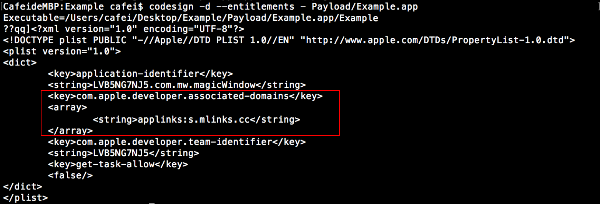

其中每个app的极光魔链域名是不一样的，并不都是s.mlinks.cc，可以在后台-app信息中查看当前app相对应的极光魔链域名是什么,如图所示

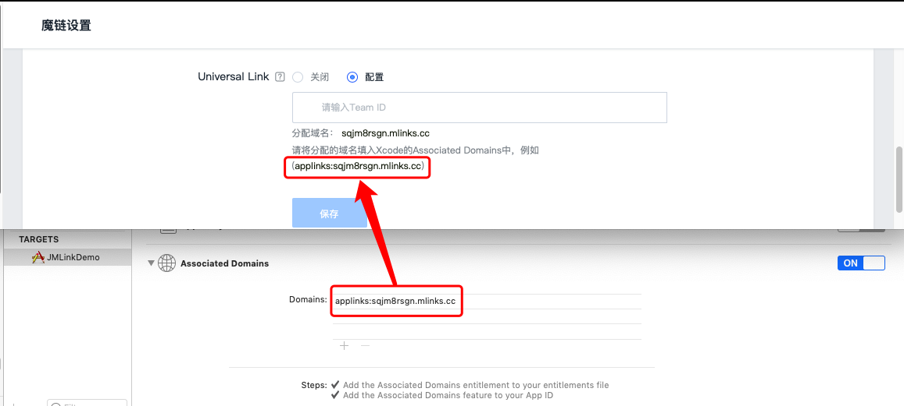

第三步，app重新签名之后，核对下bundle ID 和Team ID，与后台中的app信息是否一致

如何获取正确的team ID 和 bundle ID，如图

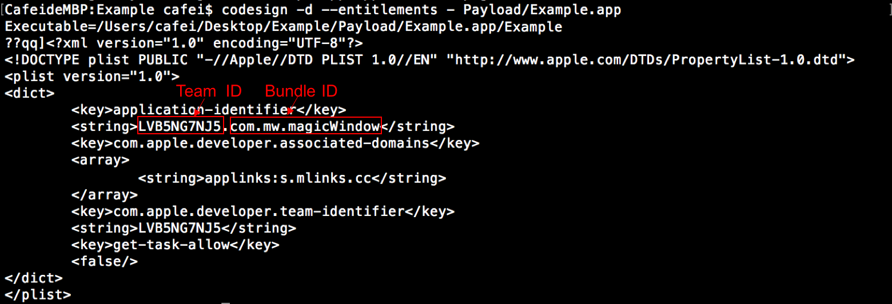

第四步，当后台app信息更新之后，需要重新安装app，这一步很重要，一定要重新安装app才可以，因为苹果应用只有2种场景才更新 apple-app-site-association 文件，分别是app安装和app更新版本

第五步，测试

## 短链接

### 1. 通过短链进入具体页面后，删除App，重新安装App，依旧进入短链对应的具体页面

程序安装后第一次打开，极光魔链mLink会跟后台通信实现场景还原。App清除数据后，mLink会判断程序为第一次安装。此时请求后台并匹配成功。所以会进入具体页面。

用户实际使用时基本不会发生此类情况。属于极小概率事件。

### 2. 短链内的参数值能动态修改么？

可以，短链支持将参数的动态值作为 query 放在后面

例如:http://a.mlinks.cc/ANax?id=12345

### 3. 一键唤起成功，场景还原失败

点击短链接的时间和安装App，第一次打开App的时间在60分钟之内，就会场景还原，（默认60分钟，时间可以在后台进行更改）。

点击短链接一键唤起成功的话，场景还原失败的话，需要debug看下，是否受到了App启动页或者引导页的影响。

场景还原和一键唤起的时候，都会走registerMLinkHandlerWithKey:(NSString *)key handler:(void (^)(NSURL * url ,NSDictionary * params))handler这个方法。

### 4. 在微信中点击短链接唤起App，在App中收到的动态参数的值不正确

可能是微信缓存造成的，退出微信登录，重新登录微信点击短链接

### 5. 在Debug下测试正常，但是在Release下不能正常一键唤起

* 后台配置的Team ID是否和App的编译证书相匹配

* update 相应的provisioning Profiles

### 6. 手机上在1个小时之内没有点击过短链接，第一次安装出现场景还原

在App之间或者iOS9＋ Safari的跳转都是精准匹配的，不会出现这个情况。

在微信中点击短链接或者其它情况下，我们会根据设备的相关参数来进行模糊匹配，比如IP地址，设备型号，分辨率等等，所以若两个用户在同一wifi环境，完全相同一手机型号时，A用户进行了场景还原，B用户只是去安装，B用户在一小时内可能出现场景还原。

因为在测试阶段，大家都是在同一个wifi下，设备型号和分辨率也相同，所以会出现没有点击短链接也场景还原的情况，但是在实际应用过程中，几乎不会出现两个不相识的用户，有一个用户安装被突然的场景还原。

### 7. 当App在openUrl方法中接收到URL后，如何确认当前的URL来源是极光魔链？

极光魔链的URL分为两种，一种是scheme，一种是universal link。

* universal link的话，有固定的域名"mlinks.cc"，比如："s.mlinks.cc"或者"s2.mlink.cc" 
* scheme的话，需要开发者自己添加标识，可以在极光魔链后台的URI中添加一个参数，类似jmlink_source=:jmlink_source 在使用极光魔链的服务唤起的时候，h5中设置这个参数为1。

### 8. 在iOS9以上，使用短链接唤起App，App接收到链接是https://s.mlinkscc/xxxx,而不是短链接或者在后台填写的scheme uri，为什么？

短链接的样式是 http://a.mlinks.cc/XXXX

iOS9及以上，App接收到的是universal link

**(注意，短链接和universal link是两个不一样的链接，不要混为一谈)**

iOS8以下，App接收到的是后台填写的scheme uri

短链接会根据不同的系统、不同的场景自动解析成universal link或者scheme来唤起App

## 应用宝

### 1. iOS7、8为什么要开启应用宝跳转？

在iOS7、8的系统中，开启应用宝跳转后可以借助应用宝跳转到AppStore，在AppSore中直接打开应用。开启方法如下：

登录腾讯开放平台，选择该iOS应用对应的AppStore版本，选择“运营服务”中的“微下载”，在微下载地址处配置对应的AppStore下载地址。

将该微下载地址填写到极光魔链后台的“高级设置”中，微下载地址的格式为“http://a.app.qq.com/o/simple.jsp?pkgname=包名”， 如http://a.app.qq.com/o/simple.jsp?pkgname=xxx.ios.client 为某应用的微下载地址。

配置完成后，在“高级设置”中开启“iOS7/8开启应用宝跳转”的开关。

## App发布

### 1. App Store提审时，对Advertising Identifier（IDFA）的配置

SDK中不会主动获取 IDFA，如应用有使用，建议将 IDFA 赋值给 JMLinkConfig 中  advertisingid 参数。App 在往 AppStore提审的时候，需要勾选以下选项

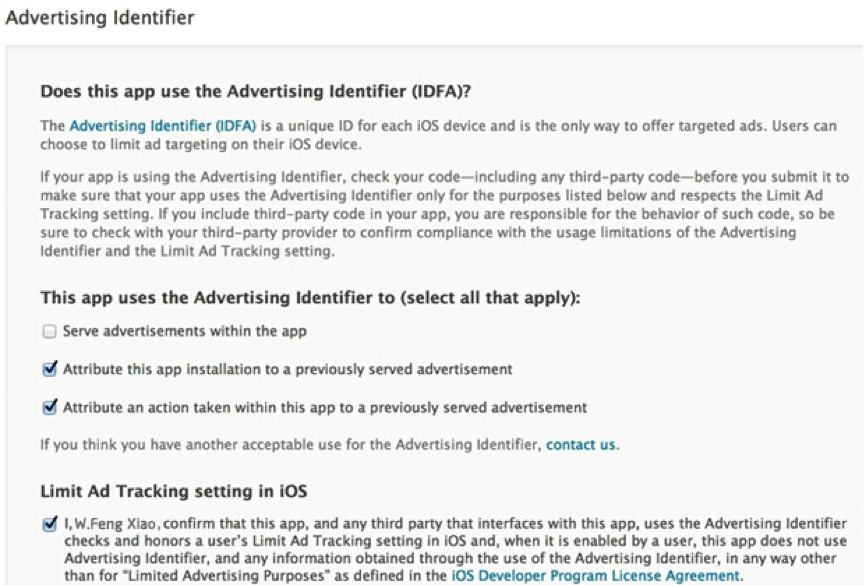

（1）Serve advertisements within the app

服务app中的广告。如果你的app中集成了广告，你需要勾选这一项。

（2）Attribute this app installation to a previously served advertisement

跟踪广告带来的安装。

（3）Attribute an action taken within this app to a previously served advertisement

跟踪广告带来的用户的后续行为。

（4）Limit Ad Tracking setting in iOS

这一项下的内容其实就是对你的app使用idfa的目的做下确认，只要你选择了采集idfa，那么这一项都是需要勾选的。

## 其他

### 1. 什么是URL Scheme，怎么配置

iOS系统中 App之前是相互隔离的，通过URL Scheme，App之间可以相互调用，并且可以传递参数。

在Xcode中，选中Target－> Info －> URL Types。比如填写 JMLinkDemo 的 uri scheme为 jgscheme ，在手机浏览器中输入 jgscheme://，如果可以唤起App，说明该 URL Scheme 配置成功。

