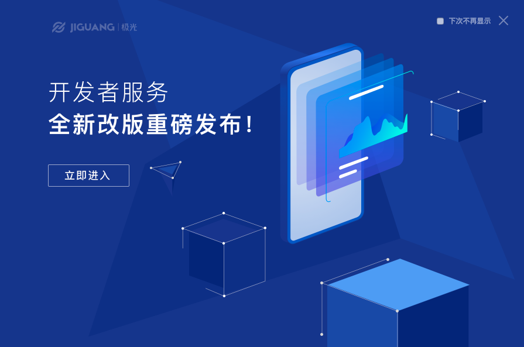

# 常见问题

## 魔链服务如何收费？
魔链提供免费的服务，无短链请求量的限制，也会在未来推出增值服务

## 「魔链平台的短链接」 和「短网址服务」有什么区别？
魔链的短链接是用于集成在产品分享的业务活动页面，关联页面上的按钮。
短网址服务是用于将您活动页面的长域名地址缩短，投放到短信中推广时可节省一定的费用，但这块需要开发者自己购置这类服务。
两者并无直接关联，产品的领域不同

## JMLink 和 mLink 有什么关联和区别？
mLink 是极光收购了魔窗的 Deeplink 服务，而后推出 JMLink 业务。核心功能上保持一致，两套服务独立运作。
建议开发者能积极升级到 JMLink 中，持续迭代更新为开发者提供优质服务。官网落地页入口已上线新版本，若依旧访问原 mLink 服务，请点击此[mLink 深度链接服务登录入口](https:mlinks.jiguang.cn)

如有疑问，请给Support发邮件：[support&#64;jpush.cn](mailto:support&#64;jpush.cn) 或者 添加 QQ 群：718411327

## 极光旧版本的后台可以使用魔链吗？
目前在全新的极光后台上操作，如有使用旧版本的开发者，请按照后台提示升级到新后台使用

## 应用是如何唤起的？
支持 Custom URI Scheme 方式，高级的通用链接如 universal links 和 applinks，以及应用宝微下载服务

## 服务是否会被微信，QQ的应用限制？
魔链短链接优先使用通用链接的能力，如在 iOS 微信 2019 年 7 月份发布的版本开放通用链接，可直接离开微信前往应用。如遇到客观限制的情况，模版页引导用户通过浏览器打开或者下载应用

## 应用全新安装，或没有在后台运行的时候，是否可以通过魔链服务启动？
能启动，魔链支持一链唤醒的功能

## 魔链 SDK 包多大？
集成到应用中后，Android 和 iOS sdk 包分别给应用增加约 200KB 和 500KB

## 支持的平台有哪些？
主流 Android/iOS/Web 一体化适配

## 老版本App没有集成SDK，但是H5中使用了短链接，该怎么处理？

* 如果开发者没有集成SDK，但是已经实现了schema，并且和在我们后台配置的一致，则除了场景还原不能实现以及监测不到可统计的数据，功能上可唤起app并传递参数

* 如果开发者没有集成SDK，而且schema也没实现，那么这个时候点击短链接永远是未下载的情况

## 老版本App集成 mlink SDK，但是H5中使用了 JMLink 新版本的短链接，该怎么处理？

* 与上一条情况一样，如果开发者集成旧版本SDK，已经实现了schema，并且在旧版本后台和新版本的后台配置的一致，则除了场景还原不能实现以及监测不到可统计的数据，功能上可唤起app并传递参数。建议按照集成文档升级，使用 JMLink 服务