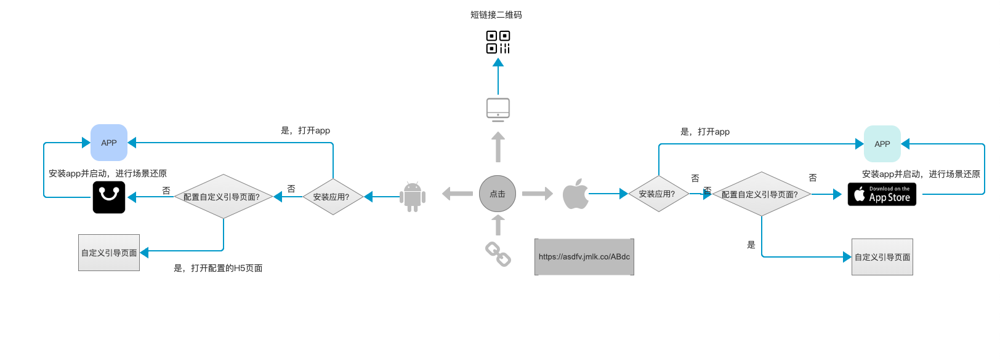

# JMLink 产品简介

<br/>

JMLink （中文：极光魔链）是企业级深度链接服务，前身为魔窗的 mlink 服务。在推广内容中结合智能短链接服务，用户点击内容或者活动按钮可启动已安装的应用并展示个性化内容给用户，未安装应用可重定向到应用市场，完成应用安装并自动接力推广内容，增强产品与用户互动性，为提升转化率提供优质服务。短链接内容投放各类渠道中，如 M站/社群应用/微博/短信/邮件等其他应用，满足多样化的运营场景，提供全方位的应用增长方案。


## 服务场景

### 一链启动
移动端 JMLink 服务可以从多种渠道中唤醒 APP 内一个具体的页面，比如可可优选应用的运营内容投放到微信中，用户点击“打开app”的按钮，可离开微信前往可可优选应用内。

</br>
投放微信内：


</br>
可可优选内：


### 场景还原
运营推广中，未安装应用的用户通过点击集成 JMLink 服务的内容，可引导到应用下载页面。当用户安装App后，第一次打开App，直接进入指定页，减少操作步骤，增加用户触达率和转化率。

### 无码邀请
通过二维码/链接等活动形式邀请新用户安装，无需新用户手动填写邀请码，JMLink 服务可识别邀请来源，帮助完成业务成就系统的闭环。常见场景中有老用户拉取新人获取成就，新人同时可领取奖励；被邀请者可直接加入游戏房间，免除用户填写邀请码。


### 服务报告
每条短链接的报告，点击/启动/安装/曝光的转化数据，横向比对服务的表现，帮助运营分析投放的渠道效果。

## 快速开始

### 致已使用 mlink 服务的开发者
若您是原有 mlink 服务的使用者，建议您尽快升级到新版本上（按照此文档集成服务），我们在 JMLink 上持续提供优质的服务。若您暂时不做升级，则可访问原mlink 服务的入口，继续使用，极光依旧维护此服务。

+ [mlink 登录后台](https://mlinks.jiguang.cn)
+ [mlink 技术文档](https://mlinks.jiguang.cn/doc)
+ [mlink BBS](https://mlinks.jiguang.cn/bbs)

```
tips

已拥有或者关联极光账号的 mlink 开发者，若升级使用新服务的后台，请用极光账号登录(https://www.jiguang.cn)新平台；
```
### 致初次使用 JMLink 服务的开发者
  1. 进入极光官网[注册开发者账号](https://www.jiguang.cn/accounts/register)；
  2. 进入[管理控制台](https://www.jiguang.cn/accounts/login/form)，创建应用程序，同时上传应用图标，用于H5展示页面，得到 AppKey（SDK与服务器端通过AppKey互相识别）
  3. 完成魔链应用的设置，应用的平台信息如应用包名/应用bundlid/scheme/应用下载地址等
  4. 在服务管理界面，创建短链接
  5. 根据Web/Android/iOS SDK 集成文档，完成集成并运行测试


##技术支持

当出现问题时：

* 请根据终端/后台等，提示错误信息做基本排查；若长时间解决不了，请按以下方式联系我们
* 给我们的Support发邮件：[support&#64;jpush.cn](mailto:support&#64;jpush.cn)
* QQ 支持群：718411327

为了更快速的解决问题，在寻求帮助时，请提供下列信息：

* 请收集相关问题的信息，比如日志/截图/视频 等，操作流程以及投放的渠道
* 提供服务名称如 JMLink 或者 mLink
* 提供appKey
* 提供完整的短链接/短链接后缀码


