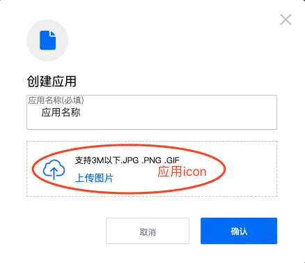
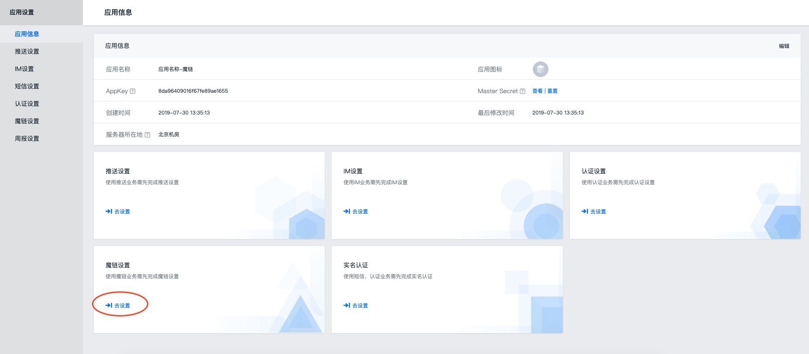
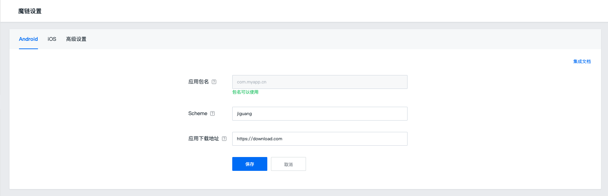
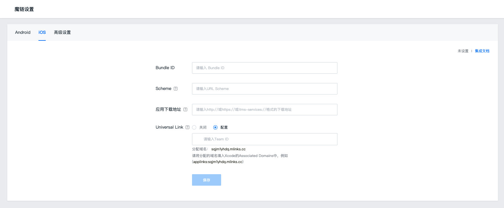
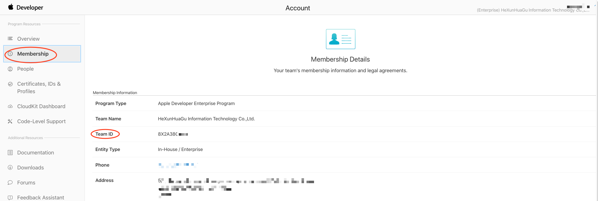
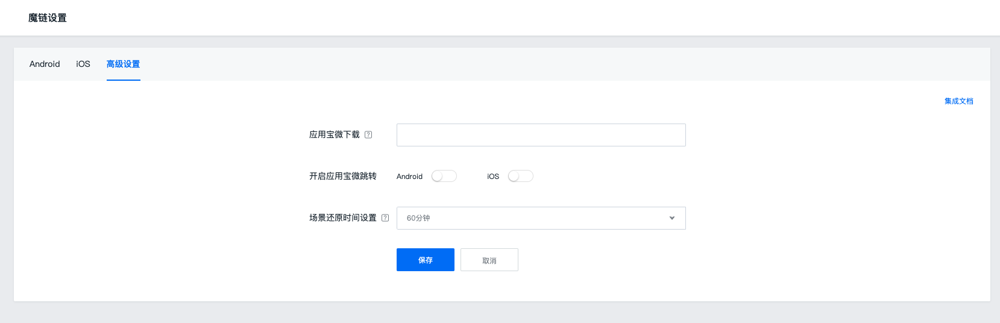
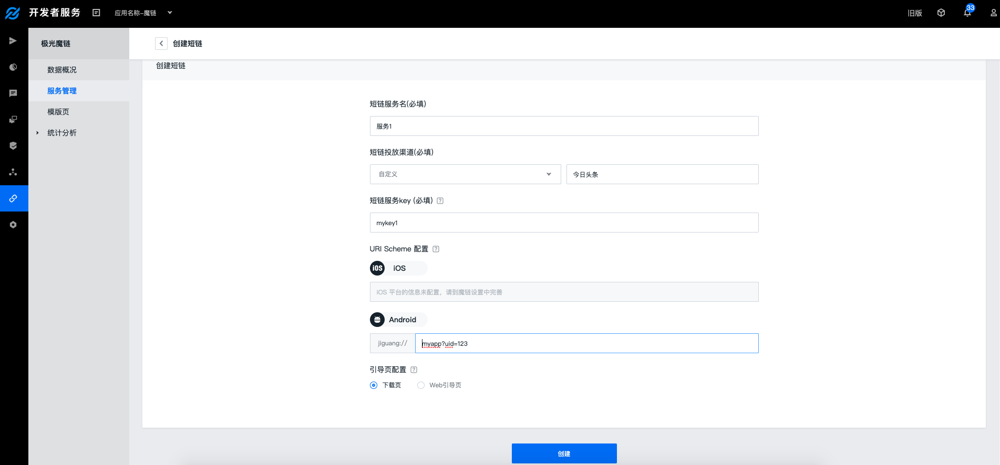
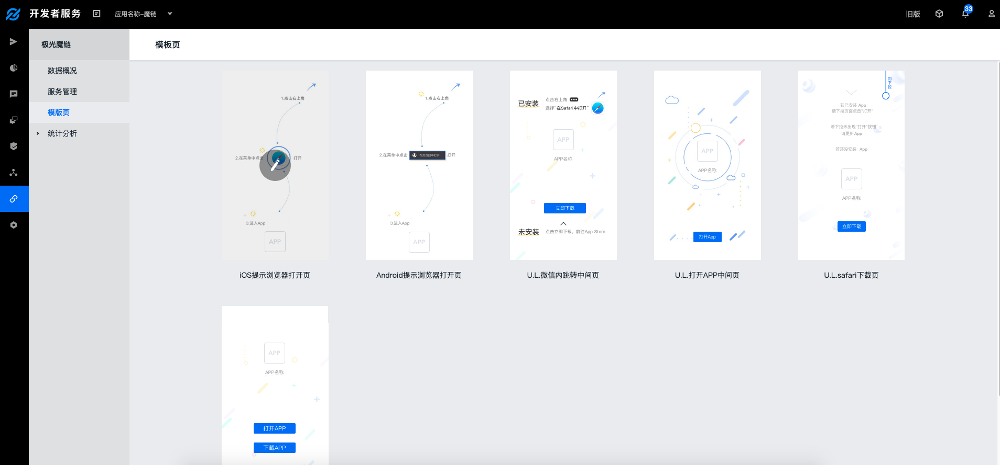
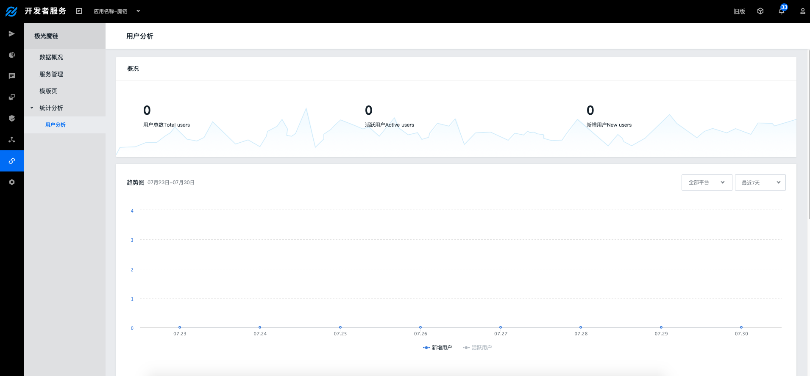

#控制台操作指南

##创建应用

###操作路径

Step1：登入控制台<br>
Step2：点击［创建应用］按钮<br>


Step3：填写［应用名称］和［应用图标］，应用名称请根据业务定义，同时请上传应用图标，用于魔链业务的模版页<br>



##魔链设置

使用极光魔链服务，需要开发者设置至少一个平台的信息，才可在服务管理界面创建短链接。



###Android



Step1：登入控制台

Step2：选择要开通魔链服务的应用，点击［应用设置］按钮<br>
Step3：左侧菜单栏选择［极光魔链］<br>
Step4：Android需填写［应用包名］/［Scheme］和应用下载地址<br>
Step5：高级设置中，建议将应用宝微下载地址配置并开启，点击保存。此功能是集成腾讯开放平台的[微下载服务](https://wiki.open.qq.com/index.php?title=mobile/%E5%BA%94%E7%94%A8%E5%AE%9D%E5%BE%AE%E4%B8%8B%E8%BD%BD#2._.E5.A6.82.E4.BD.95.E8.8E.B7.E5.8F.96.E5.BE.AE.E4.B8.8B.E8.BD.BD.E9.93.BE.E6.8E.A5)，它格式为[a.app.qq.com/xxx]，建议开启<br>


###iOS



Step1：登入控制台<br>
Step2：选择要开通魔链服务的应用，点击［应用设置］按钮<br>
Step3：左侧菜单栏选择［极光魔链］<br>
Step4：iOS应用需填写［Bundle ID］/ [Scheme] / 应用下载地址/开启 Universal link 配置，点击［保存］按钮，其中[Universal link](https://developer.apple.com/ios/universal-links/) 是苹果官网深度链接服务，支持 iOS 9 +的设备，建议开启！TeamID 为大写字母和数字组合，登录[苹果开发者网站](https://developer.apple.com/)，点击Account -> 点击Membership ，可查看到其信息<br>



Step5: 高级设置中，建议将应用宝微下载地址配置并开启，点击保存。腾讯开放平台的[微下载服务](https://wiki.open.qq.com/index.php?title=mobile/%E5%BA%94%E7%94%A8%E5%AE%9D%E5%BE%AE%E4%B8%8B%E8%BD%BD#2._.E5.A6.82.E4.BD.95.E8.8E.B7.E5.8F.96.E5.BE.AE.E4.B8.8B.E8.BD.BD.E9.93.BE.E6.8E.A5)<br>



```
tips
1. 建议 Android 和 iOS 平台配置相同的 Scheme ，拼写规则仅支持小写字母开头，小写字母和数字组合，系统自动添加后缀"://"
2. iOS 平台设置中，开启 Universal link ，系统分配可使用的关联域名（Associated Domains）例如 yhdq.jmlk.co，在客户端工程集成时使用。
3. 应用宝微下载服务适用于Android 和 iOS 平台特定应用中，android 全系统/iOS 9以下系统的微信中均适用。
```

##服务管理

###创建短链



完成应用设置后，可在服务管理中，创建可以投放的短链接，短链接用于 [Web sdk 集成](../client/Web/jmlink_web_sdk/)时使用。

Step1：点击创建短链按钮<br>
Step2：填写短链接的名称/投放渠道/短链服务key/平台 URI Scheme 信息，其中 URI Scheme 配置需与客户端开发协商，了解[URI Scheme 使用技巧](../advanced/scenes/)<br>
Step3：默认引导页设置配置为下载页面。<!-- 如果选择Web 引导页，则当应用没有安装时，触发深度链接服务会重定向到此地址 --> <br>
Setp4：点击保存<br>

###短链接


+ 展示详情，可查看关键性信息，比如短链Key，用于客户端SDK 路由解析。完整短链接，以及配置的URI Scheme。
+ 点击编辑，可修改短链接配置的参数
+ 点击分析，每条短链接的数据可查看，主要有点击/启动/安装/曝光，定义为点击短链接的次数/通过短链接唤起应用的次数/通过短链接带来应用安装的次数/短链接加载的次数
+ 删除操作，删除短链接后，此链接服务停止，即浏览器访问则提示服务不可用

###模版页



许多应用都有自身的“生态环境”，往往会遇到限制深度链接跳转的情况，针对此类场景，在停留的地方极光提供模版页来展示和引导。默认的提供多种模版页样式。建议开发者自定义，根据企业定位结合业务，打造统一的UI风格

```
tips
请设置应用图标，模版页中会使用。设置入口在[应用设置] -> 编辑应用 -> 设置图标
```

##统计分析
###用户分析
统计集成魔链业务的用户数据，每个一个小时更新一次数据。


